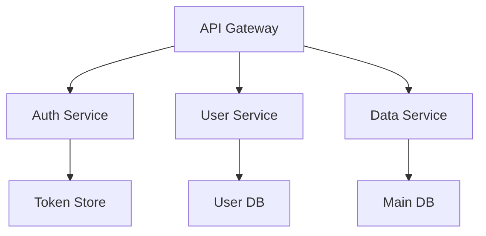

# Mintlify Documentation Guide with Diátaxis Framework

## Overview ◇⟲◈⟲◇

This guide combines the power of Mintlify's modern documentation platform with the systematic approach of the Diátaxis framework. Mintlify provides beautiful, searchable, and interactive documentation, while Diátaxis ensures your content is well-organized and serves user needs effectively.

## Quick Start ⚡

### Prerequisites
- Node.js 18+ installed
- Basic understanding of Markdown
- Git repository for your documentation

### Installation

```bash
# Install Mintlify CLI
npm i -g mintlify

# Initialize in your docs directory
mintlify init
```

## Understanding Diátaxis in Mintlify Context 📚

Diátaxis identifies four distinct types of documentation, each serving different user needs:

### 1. **Tutorials** (Learning-Oriented) 🎓
- **Purpose**: Help beginners learn through hands-on experience
- **Mintlify Implementation**: Create step-by-step guides with code snippets and interactive examples
- **Location**: `/tutorials/` directory

### 2. **How-To Guides** (Task-Oriented) 🎯
- **Purpose**: Help users accomplish specific goals
- **Mintlify Implementation**: Problem-solving guides with clear outcomes
- **Location**: `/how-to/` directory

### 3. **Reference** (Information-Oriented) 📖
- **Purpose**: Provide technical descriptions and API documentation
- **Mintlify Implementation**: Use Mintlify's API reference features and tables
- **Location**: `/reference/` directory

### 4. **Explanation** (Understanding-Oriented) 💡
- **Purpose**: Provide context, background, and deeper understanding
- **Mintlify Implementation**: Conceptual articles with diagrams
- **Location**: `/explanation/` directory

## Mintlify Configuration for Diátaxis

### mint.json Structure

```json
{
  "$schema": "https://mintlify.com/schema.json",
  "name": "Your Documentation",
  "logo": {
    "dark": "/logo/dark.svg",
    "light": "/logo/light.svg"
  },
  "favicon": "/favicon.svg",
  "colors": {
    "primary": "#0D9373",
    "light": "#07C983",
    "dark": "#0D9373",
    "anchors": {
      "from": "#0D9373",
      "to": "#07C983"
    }
  },
  "navigation": [
    {
      "group": "Getting Started",
      "pages": ["introduction", "quickstart"]
    },
    {
      "group": "Tutorials",
      "pages": [
        "tutorials/overview",
        "tutorials/first-steps",
        "tutorials/build-your-first-app"
      ]
    },
    {
      "group": "How-To Guides",
      "pages": [
        "how-to/overview",
        "how-to/authentication",
        "how-to/deployment",
        "how-to/troubleshooting"
      ]
    },
    {
      "group": "Reference",
      "pages": [
        "reference/overview",
        "reference/api-reference",
        "reference/configuration",
        "reference/cli-commands"
      ]
    },
    {
      "group": "Explanation",
      "pages": [
        "explanation/overview",
        "explanation/architecture",
        "explanation/design-decisions",
        "explanation/best-practices"
      ]
    }
  ],
  "footerSocials": {
    "github": "https://github.com/yourorg/yourrepo",
    "twitter": "https://twitter.com/yourhandle"
  }
}
```

## Directory Structure 📁

```
docs/
├── mint.json
├── introduction.mdx
├── quickstart.mdx
├── tutorials/
│   ├── overview.mdx
│   ├── first-steps.mdx
│   └── build-your-first-app.mdx
├── how-to/
│   ├── overview.mdx
│   ├── authentication.mdx
│   ├── deployment.mdx
│   └── troubleshooting.mdx
├── reference/
│   ├── overview.mdx
│   ├── api-reference.mdx
│   ├── configuration.mdx
│   └── cli-commands.mdx
└── explanation/
    ├── overview.mdx
    ├── architecture.mdx
    ├── design-decisions.mdx
    └── best-practices.mdx
```

## Content Templates 📝

### Tutorial Template

```markdown
---
title: 'Tutorial: Building Your First Widget'
description: 'Learn how to create a widget step-by-step'
icon: 'graduation-cap'
---

## What You'll Learn

In this tutorial, you will:
- Set up your development environment
- Create your first widget
- Test and deploy it

<Note>
  This tutorial takes approximately 30 minutes to complete.
</Note>

## Prerequisites

Before starting, ensure you have:
- Node.js 18+ installed
- Basic JavaScript knowledge
- A code editor

## Step 1: Set Up Your Environment

Let's begin by creating a new project:

```bash
mkdir my-widget
cd my-widget
npm init -y
```

<Check>
  You should now have a `package.json` file in your directory.
</Check>

## Step 2: Install Dependencies

[Continue with clear, numbered steps...]

## What You've Accomplished

Congratulations! You've successfully:
- ✅ Created your first widget
- ✅ Learned the basic concepts
- ✅ Deployed to production

## Next Steps

Ready to learn more? Check out:
- [Advanced Widget Features](/tutorials/advanced-widgets)
- [Widget Best Practices](/explanation/widget-patterns)
```

### How-To Guide Template

```markdown
---
title: 'How to Configure Authentication'
description: 'Set up authentication for your application'
icon: 'shield-halved'
---

## Goal

Configure OAuth 2.0 authentication with multiple providers.

<Warning>
  This guide assumes you already have a working application.
</Warning>

## When to Use This

Use this guide when you need to:
- Add user authentication
- Support multiple auth providers
- Implement secure API access

## Requirements

- API keys from your auth provider
- SSL certificate configured
- Database for user sessions

## Steps

### 1. Register Your Application

First, register your app with your chosen provider:

<Tabs>
  <Tab title="GitHub">
    1. Go to GitHub Settings > Developer settings
    2. Click "New OAuth App"
    3. Fill in the required fields
  </Tab>
  <Tab title="Google">
    1. Visit Google Cloud Console
    2. Create a new project
    3. Enable OAuth 2.0
  </Tab>
</Tabs>

### 2. Configure Environment Variables

[Continue with practical steps...]

## Troubleshooting

<AccordionGroup>
  <Accordion title="Invalid redirect URI error">
    Ensure your redirect URI matches exactly what you registered.
  </Accordion>
  <Accordion title="Token expiration issues">
    Implement refresh token logic as shown above.
  </Accordion>
</AccordionGroup>

## Related Guides

- [How to Implement SSO](/how-to/sso)
- [How to Secure API Endpoints](/how-to/api-security)
```

### Reference Template

```markdown
---
title: 'Configuration Reference'
description: 'Complete configuration options for the system'
icon: 'gear'
---

## Configuration File

The main configuration file `config.json` contains all system settings.

### Structure

```json
{
  "version": "string",
  "settings": {
    "debug": "boolean",
    "port": "number",
    "host": "string"
  }
}
```

### Properties

<ParamField path="version" type="string" required>
  The configuration schema version. Currently supports "1.0" or "2.0".
</ParamField>

<ParamField path="settings.debug" type="boolean" default="false">
  Enable debug mode for verbose logging.
</ParamField>

<ParamField path="settings.port" type="number" default="3000">
  Port number for the server. Must be between 1-65535.
</ParamField>

### Environment Variables

| Variable | Type | Default | Description |
|----------|------|---------|-------------|
| `NODE_ENV` | string | "development" | Runtime environment |
| `API_KEY` | string | - | API authentication key |
| `DB_URL` | string | "localhost" | Database connection URL |

### CLI Commands

<CodeGroup>
```bash npm
npm run config:validate
```

```bash yarn
yarn config:validate
```
</CodeGroup>

## See Also

- [API Reference](/reference/api)
- [CLI Reference](/reference/cli)
```

### Explanation Template

```markdown
---
title: 'Understanding Our Architecture'
description: 'Deep dive into the system architecture and design decisions'
icon: 'sitemap'
---

## Overview

Our system follows a microservices architecture pattern. This document explains why we made this choice and how the components interact.

## Historical Context

When we started in 2020, monolithic architectures were showing their limitations for our use case...

## Core Concepts

### Service Mesh

A service mesh provides:
- **Traffic management**: Load balancing and routing
- **Security**: mTLS between services
- **Observability**: Distributed tracing



### Event-Driven Design

We chose event-driven architecture because:
1. **Decoupling**: Services don't need direct knowledge of each other
2. **Scalability**: Easy to scale individual components
3. **Resilience**: Failures don't cascade

## Trade-offs and Alternatives

### What We Considered

1. **Monolithic Architecture**
   - Pros: Simple deployment, easier debugging
   - Cons: Scaling challenges, technology lock-in

2. **Serverless**
   - Pros: No infrastructure management
   - Cons: Vendor lock-in, cold starts

### Why Microservices Won

[Continue with detailed reasoning...]

## Further Reading

- [Microservices Patterns](https://microservices.io/patterns/)
- [Domain-Driven Design](/explanation/ddd)
- [Our API Design Philosophy](/explanation/api-philosophy)
```

## Best Practices for Diátaxis in Mintlify ⚡

### 1. **Use Mintlify Components Wisely**

- **Callouts**: Use for important information
  - `<Note>` for general information
  - `<Warning>` for cautions
  - `<Tip>` for helpful suggestions
  - `<Check>` for validation steps in tutorials

### 2. **Navigation Principles**

- Keep tutorial navigation linear
- Group how-to guides by task category
- Organize reference by system structure
- Link explanations contextually

### 3. **Cross-Linking Strategy**

```markdown
<!-- In a tutorial -->
For more details about authentication, see our [authentication explanation](/explanation/auth-concepts).

<!-- In a how-to guide -->
New to our platform? Start with the [getting started tutorial](/tutorials/first-steps).

<!-- In reference -->
To understand why we use this approach, read [our architecture decisions](/explanation/architecture).

<!-- In explanation -->
Ready to implement? See [how to configure authentication](/how-to/authentication).
```

### 4. **Search Optimization**

- Use clear, descriptive titles
- Add comprehensive descriptions in frontmatter
- Include relevant keywords naturally
- Use heading hierarchy properly

### 5. **Version Control Integration**

```yaml
# .github/workflows/mintlify.yml
name: Mintlify Documentation

on:
  push:
    branches: [main]
  pull_request:
    branches: [main]

jobs:
  docs:
    runs-on: ubuntu-latest
    steps:
      - uses: actions/checkout@v3
      - uses: mintlify/actions@v1
        with:
          token: ${{ secrets.MINTLIFY_TOKEN }}
```

## The Diátaxis Compass in Practice 🧭

When creating or reviewing documentation, ask:

1. **Does this inform action or cognition?**
   - Action → Tutorial or How-To
   - Cognition → Reference or Explanation

2. **Is this for skill acquisition or application?**
   - Acquisition → Tutorial or Explanation
   - Application → How-To or Reference

### Decision Matrix

| If the content... | ...and serves the user's... | ...then create a... |
|-------------------|----------------------------|-------------------|
| Informs action | Acquisition of skill | Tutorial |
| Informs action | Application of skill | How-to guide |
| Informs cognition | Application of skill | Reference |
| Informs cognition | Acquisition of skill | Explanation |

## Workflow: From Idea to Published Doc 🔄

1. **Identify the Need**
   - What problem does this solve?
   - Who is the audience?
   - What should they achieve?

2. **Choose the Type**
   - Use the Diátaxis compass
   - Select appropriate template
   - Plan the structure

3. **Write and Review**
   ```bash
   # Create new document
   touch docs/how-to/new-feature.mdx

   # Preview locally
   mintlify dev

   # Check for issues
   mintlify validate
   ```

4. **Test with Users**
   - Can beginners follow tutorials?
   - Do how-tos solve real problems?
   - Is reference complete and findable?
   - Do explanations clarify concepts?

5. **Iterate and Improve**
   - Monitor analytics
   - Gather feedback
   - Update regularly
   - Maintain consistency

## Common Pitfalls to Avoid ❌

1. **Mixing Types**
   - Don't explain in tutorials
   - Don't teach in how-to guides
   - Don't guide in reference
   - Don't list facts in explanations

2. **Wrong Assumptions**
   - Tutorials: Assume no prior knowledge
   - How-tos: Assume competence
   - Reference: Assume immediate need
   - Explanation: Assume curiosity

3. **Poor Organization**
   - Avoid deep nesting (>3 levels)
   - Don't duplicate content
   - Maintain clear boundaries
   - Use consistent naming

## Measuring Success 📊

### Metrics to Track

1. **Engagement**
   - Time on page by doc type
   - Completion rates for tutorials
   - Search queries and failures

2. **User Journey**
   - Path from tutorial to how-to
   - Reference lookup patterns
   - Explanation engagement

3. **Feedback**
   - Doc ratings
   - Support ticket reduction
   - Community questions

## Resources and References 📚

- [Diátaxis Official Site](https://diataxis.fr)
- [Mintlify Documentation](https://mintlify.com/docs)
- [Example Implementations](https://github.com/mintlify/starter)

---

*Remember: Good documentation is never finished, only improved. Start small, iterate often, and always keep your users' needs at the center of your work.*

---
